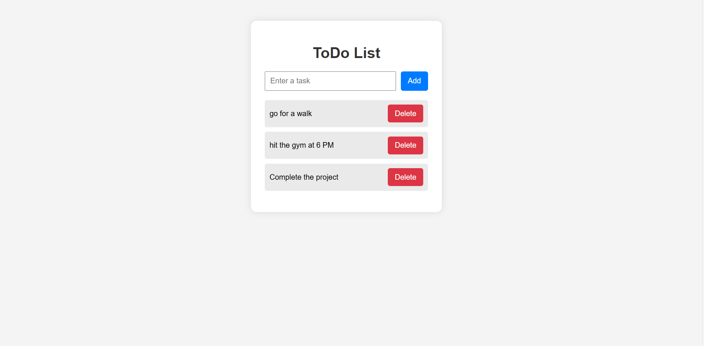

# Simple ToDo List App

This is a simple ToDo List web app built with HTML, CSS, and JavaScript.  
It lets you add tasks, delete tasks, and persists your list using localStorage so your tasks stay even after refreshing the page.

## Features

✅ Add new tasks  
✅ Delete tasks  
✅ Data persists in localStorage  
✅ Simple and clean UI  

## How to Run

1. Clone the repo:
    ```
    git clone https://github.com/eshwarvk/todo.git
    ```

2. Open `index.html` in your browser.

That's it!

## Screenshot

*(Optional — add a screenshot image of your app here!)*



---

## Author

Eshwar
(https://github.com/eshwarvk)
